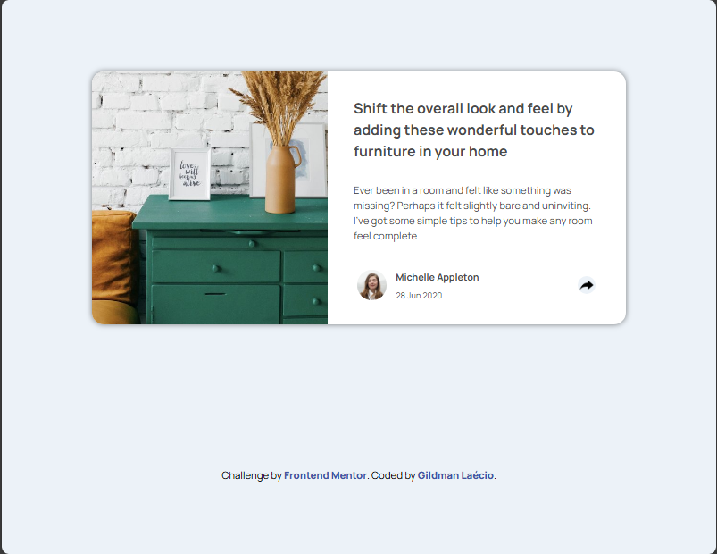
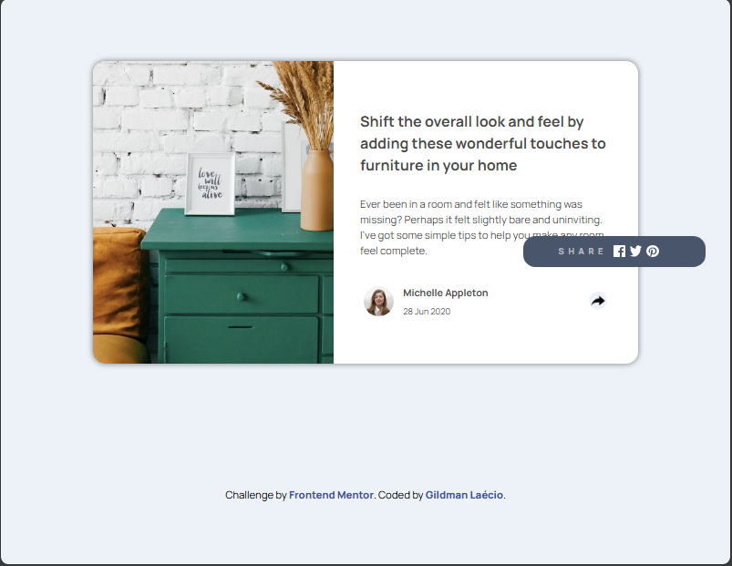
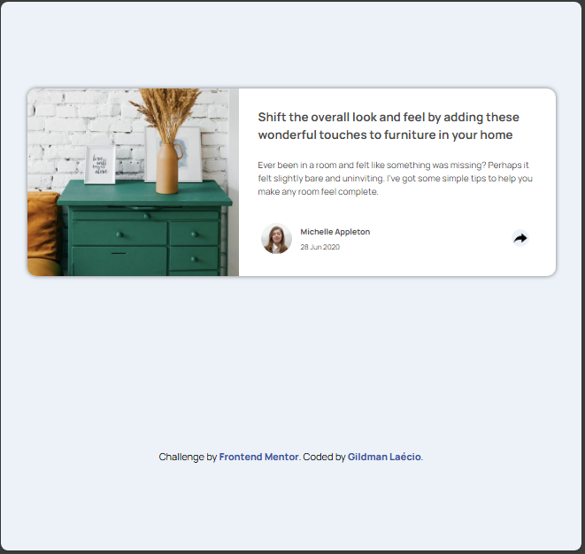
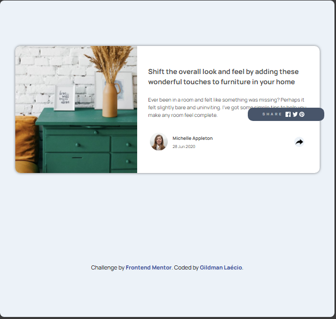
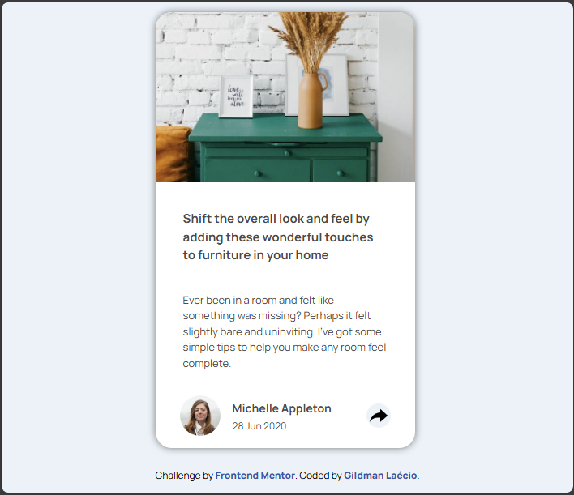
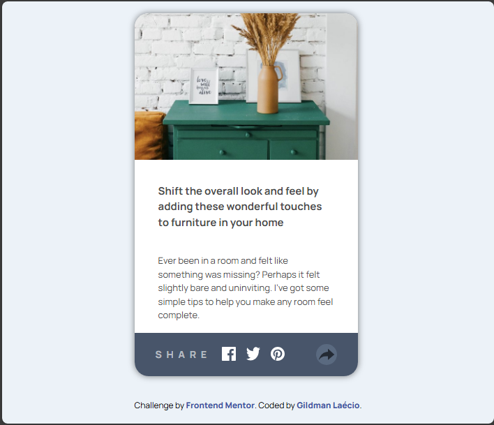

# article-preview-component-master
 article-preview-component-master

This is a solution to the [Article-preview-card-component-master challenge on Frontend Mentor](https://www.frontendmentor.io/learning-paths/javascript-fundamentals-oR7g6-mTZ-/steps/67c162d78e9721b35e4826a3/challenge/start). Frontend Mentor challenges help you improve your coding skills by building realistic projects. 

## Table of contents

- [Overview](#overview)
  - [Screenshot](#screenshot)
  - [Links](#links)
- [My process](#my-process)
  - [Built with](#built-with)
  - [What I learned](#what-i-learned)
  - [Continued development](#continued-development)
- [Author](#author)

## Overview

### Screenshot

These are my screenshots showing how the project turned out.

- For desktop version:

Desktop below 1201px normal state



Desktop below 1201px active state



Desktop above 1201px normal state



Desktop above 1201px active state



- For mobile version:

Normal state



Active state



### Links

- Solution URL: [My Solution](https://gillaercio.github.io/stats-preview-card-component-main/)

## My process

### Built with

- Semantic HTML5 markup
- CSS custom properties
- Grid Layout
- Mobile-first workflow
- JavaScript

### What I learned

I took advantage of this project to practice the use of **JavaScript**:

Conditional Ternary Operator

```javascript
const ajustes = {
    pequeno: {
      avatarBg: state ? "white" : "var(--Very-Dark-Grayish-Blue)",
      avatarBorderBottomLeftRadius: "20px",
      avatarBorderBottomRightRadius: "20px",
      ftImgSize: "210px",
      picAvatarDisplay: state ? "block" : "none",
      infoAvatarDisplay: state ? "grid" : "none",
      messageShareDisplay: state ? "none" : "block",
      socialIconsDisplay: state ? "none" : "grid",
      btnShareBg: state ? "var(--Light-Grayish-Blue)" : "var(--Desaturated-Dark-Blue)",
      shareImg: state ? "../images/forward_icon-share.png" : "../images/forward_icon-share-active2.png",
      btnShareOpacity: state ? "1" : ".5",
      shareBarDisplay: "none"
    },
    medio: {
      messageShareDisplay: "none",
      messageBarDisplay: state ? "none" : "block",
      socialIconsBarDisplay: state ? "none" : "block",
      ftImgHeight: state ? "424px" : "498px",
      shareBarDisplay: state ? "none" : "grid"
    },
    grande: {
      messageShareDisplay: "none",
      messageBarDisplay: state ? "none" : "block",
      socialIconsBarDisplay: state ? "none" : "block",
      ftImgHeight: state ? "478px" : "498px",
      shareBarDisplay: state ? "none" : "grid"
    }
  };
```

Arrow Function

```javascript
const aplicarAjustes = config => {
    elementos.avatar.style.backgroundColor = config.avatarBg || elementos.avatar.style.backgroundColor;
    elementos.avatar.style.borderBottomLeftRadius = config.avatarBorderBottomLeftRadius || elementos.avatar.style.borderBottomLeftRadius;
    elementos.avatar.style.borderBottomRightRadius = config.avatarBorderBottomRightRadius || elementos.avatar.style.borderBottomRightRadius;
    elementos.ftImg.style.height = config.ftImgHeight || config.ftImgSize;
    elementos.picAvatar.style.display = config.picAvatarDisplay;
    elementos.infoAvatar.style.display = config.infoAvatarDisplay;
    elementos.messageShare.style.display = config.messageShareDisplay;
    elementos.messageBar.style.display = config.messageBarDisplay;
    elementos.socialIcons.style.display = config.socialIconsDisplay || elementos.socialIcons.style.display;
    elementos.socialIconsBar.style.display = config.socialIconsBarDisplay;
    elementos.btnShare.style.backgroundColor = config.btnShareBg || elementos.btnShare.style.backgroundColor;
    elementos.share.style.backgroundImage = `url('${config.shareImg}')`;
    elementos.btnShare.style.opacity = config.btnShareOpacity;
    elementos.shareBar.style.display = config.shareBarDisplay;
  };

### Continued development

I would like to improve the use of the **JavaScript**.

## Author

- Frontend Mentor - [@gillaercio](https://www.frontendmentor.io/profile/gillaercio)
- Github - [My Github](https://github.com/gillaercio)
- LinkedIn - [My LinkedIn](https://www.linkedin.com/in/gildman-la%C3%A9rcio/)